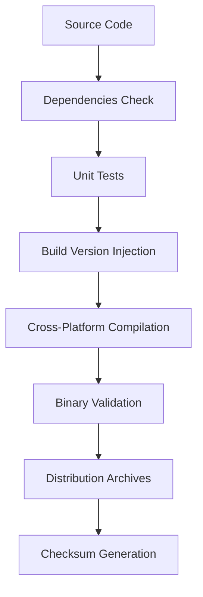

# R2Go2 Project Structure

This document provides a comprehensive overview of the R2Go2 project structure, architectural patterns, and design decisions.

## 🏗️ High-Level Architecture

```
R2Go2/
├── 📱 cmd/                    # CLI Commands Layer
├── 🔧 internal/               # Internal Packages
├── 📚 docs/                   # Documentation
├── 🏗️ build/                  # Build Artifacts (generated)
├── 🔨 dist/                   # Distribution (generated)
├── ⚙️ build-tracking/         # Version Tracking (generated)
├── 🔒 .git/                   # Git Repository
├── 📄 main.go                 # Application Entry Point
├── 📦 go.mod                  # Go Module Definition
├── 🛠️ Makefile               # Build Automation
├── 📋 VERSION                 # Version File
├── 📖 README.md              # User Documentation
└── 🏷️ .version-registry.json # Version Configuration
```

## 📁 Directory Structure

### `cmd/` - CLI Commands Layer

The `cmd/` directory contains all CLI command implementations using the Cobra framework.

```bash
cmd/
├── root.go          # 🎯 Root command and global flags
├── create.go        # 🪣 Bucket creation command
├── list.go          # 📋 Bucket listing command
├── delete.go        # 🗑️ Bucket deletion command
├── upload.go        # 📤 File upload command
├── policy.go        # ⚙️ Lifecycle policy command
└── completion.go    # 🔧 Shell completion support
```

**Responsibilities:**
- Command-line interface definition
- User input validation
- Command execution orchestration
- Output formatting and presentation
- Error handling and user feedback

**Design Patterns:**
- **Command Pattern**: Each file implements a specific command
- **Factory Pattern**: Root command creates subcommands
- **Template Method**: Consistent command structure across all commands

### `internal/` - Internal Packages

The `internal/` directory contains packages that are not intended for external use.

```bash
internal/
└── api/               # 🌐 R2 API Wrapper
    ├── r2.go         # Main API client implementation
    └── r2_test.go    # Comprehensive unit tests
```

**Responsibilities:**
- Cloudflare R2 API abstraction
- HTTP client management
- Request/response handling
- Error mapping and conversion
- Data validation and transformation

**Future Internal Packages:**
```bash
internal/
├── api/               # 🌐 R2 API Wrapper
├── config/            # ⚙️ Configuration Management (planned)
├── storage/           # 💾 Secure Credential Storage (planned)
├── utils/             # 🔧 Utility Functions (planned)
└── types/             # 📋 Type Definitions (planned)
```

### `docs/` - Documentation

The `docs/` directory contains comprehensive documentation for the project.

```bash
docs/
├── 📁 sessions/              # Session Documentation
│   ├── README.md            # Session guide
│   └── 001-initial-bootstrap.md  # First session summary
├── 📁 planning-mode/         # Development Planning
│   └── 2025-11-24-r2go2-initial-development.md
├── 📁 prompts/               # AI Integration Prompts
│   └── cli-feature-commands.md
├── 📁 roadmap/               # Feature Roadmap
│   └── roadmap.md
├── 📁 brainstorming/         # Feature Ideas
│   └── feature-ideas.md
├── 📄 project-structure.md   # This file
├── 📄 development.md         # Development Guidelines (planned)
└── 📄 api-reference.md       # API Documentation (planned)
```

**Documentation Strategy:**
- **User Documentation**: README.md and usage guides
- **Developer Documentation**: Architecture, API reference, development guides
- **Session Documentation**: Chronological development tracking
- **AI Integration**: Prompts and examples for AI assistants

### Build and Distribution Artifacts

Generated directories that are not tracked in version control:

```bash
build/                    # 🏗️ Local build artifacts
└── r2go2                 # Current platform binary

dist/                     # 📦 Distribution archives
├── r2go2-0.1.0-linux-amd64.tar.gz
├── r2go2-0.1.0-linux-arm64.tar.gz
├── r2go2-0.1.0-darwin-amd64.tar.gz
├── r2go2-0.1.0-darwin-arm64.tar.gz
└── r2go2-0.1.0-windows-amd64.zip

build-tracking/           # ⚙️ Universal versioning system
├── repository.build      # Build counter
├── repository.date       # Build date
└── components/           # Component build tracking
    ├── apps/
    ├── libs/
    ├── commands/
    ├── agents/
    └── infra/
```

## 🏗️ Architectural Patterns

### 1. Layered Architecture

```
┌─────────────────────────────────────┐
│              CLI Layer               │  ← cmd/ (User Interface)
│  ┌─────────┬─────────┬─────────────┐ │
│  │ Commands│ Output  │ Validation  │ │
│  └─────────┴─────────┴─────────────┘ │
├─────────────────────────────────────┤
│            Application Layer         │  ← main.go (Orchestration)
│      Build Injection & Init         │
├─────────────────────────────────────┤
│             Service Layer            │  ← internal/api/ (Business Logic)
│  ┌─────────┬─────────┬─────────────┐ │
│  │ R2 API  │ Mock    │ Validation  │ │
│  └─────────┴─────────┴─────────────┘ │
├─────────────────────────────────────┤
|           External Dependencies      |  ← Cloudflare SDK, Cobra
└─────────────────────────────────────┘
```

### 2. Command Pattern Implementation

Each command follows a consistent structure:

```go
// Command Structure Template
var commandCmd = &cobra.Command{
    Use:   "command <args>",
    Short: "Brief description",
    Long:  `Detailed description with examples`,
    Args:  func(cmd *cobra.Command, args []string) error { /* validation */ },
    Run:   func(cmd *cobra.Command, args []string) { /* implementation */ },
}
```

### 3. Repository Pattern (Planned)

Future implementation for configuration and credential storage:

```go
// Planned Repository Interface
type Repository interface {
    Save(config *Config) error
    Load() (*Config, error)
    Delete() error
}

// Implementation Examples
type ConfigFileRepository struct{ /* file-based storage */ }
type SecureRepository struct{ /* encrypted storage */ }
type CloudRepository struct{ /* cloud-based storage */ }
```

## 🔄 Data Flow Architecture

### Command Execution Flow

```
User Input
    ↓
CLI Argument Parsing (Cobra)
    ↓
Environment Variable Validation
    ↓
Global Flag Processing
    ↓
Command-Specific Validation
    ↓
API Client Creation
    ↓
Business Logic Execution
    ↓
Response Formatting
    ↓
Output (JSON/Human-Readable)
```

### Error Handling Flow

```
Error Occurrence
    ↓
Error Mapping (API → CLI)
    ↓
Context Information Addition
    ↓
Format Selection (JSON/Standard)
    ↓
User-Friendly Message Generation
    ↓
Troubleshooting Tips Addition
    ↓
Output & Exit Code
```

## 🔧 Configuration Management (Planned)

### Future Configuration Structure

```yaml
# .r2go2.yaml (planned)
profiles:
  default:
    account_id: "your-account-id"
    api_token_source: "env" # env, file, keyring
    default_region: "auto"
    output_format: "human" # human, json
    verbose: false

  production:
    account_id: "prod-account-id"
    api_token_source: "keyring"
    default_region: "us-east-1"
    output_format: "json"
    verbose: false

settings:
  upload_concurrency: 4
  chunk_size: "8MB"
  retry_attempts: 3
  timeout: "30s"
  ssl_verify: true

security:
  token_encryption: true
  audit_logging: false
  session_timeout: "1h"
```

### Credential Storage Strategy (Planned)

1. **Environment Variables** (Current): `CLOUDFLARE_API_TOKEN`, `CLOUDFLARE_ACCOUNT_ID`
2. **Encrypted Config Files**: `.r2go2.yaml` with encrypted sensitive fields
3. **System Keyring**: OS credential manager integration
4. **Cloud Key Management**: AWS KMS, HashiCorp Vault integration

## 🧪 Testing Architecture

### Test Structure

```
tests/
├── unit/                    # Unit tests (current)
│   └── internal/api/
│       ├── r2_test.go      # API client tests
│       └── mocks/          # Mock implementations
├── integration/            # Integration tests (planned)
│   ├── api/               # Real API tests
│   └── cli/               # End-to-end CLI tests
├── fixtures/              # Test data and fixtures
│   ├── responses/         # Mock API responses
│   └── files/            # Test files for upload
└── benchmarks/            # Performance tests
    └── upload/           # Upload performance tests
```

### Mock Strategy

Current mock implementation provides realistic data for development:

```go
// Mock bucket data
func (c *Client) ListBuckets() ([]*Bucket, error) {
    return []*Bucket{
        {
            Name:        "example-bucket-1",
            CreatedDate: time.Now().AddDate(0, 0, -7),
        },
        {
            Name:        "example-bucket-2",
            CreatedDate: time.Now().AddDate(0, 0, -14),
        },
    }, nil
}
```

## 🔒 Security Architecture

### Current Security Measures

1. **Token Masking**: Sensitive data masked in logs
2. **Environment Variables**: No hardcoded credentials
3. **Input Validation**: All user inputs validated
4. **Error Message Sanitization**: No sensitive data in errors

### Planned Security Enhancements

1. **Credential Encryption**: Encrypt sensitive data at rest
2. **Access Controls**: Role-based access permissions
3. **Audit Logging**: Operation audit trail
4. **Secure Storage**: Integration with system keychains
5. **Token Rotation**: Automatic token refresh capabilities

## 📦 Build and Distribution Architecture

### Multi-Platform Build Matrix

| Platform | Architecture | Binary Name | Distribution |
|----------|--------------|-------------|--------------|
| Linux    | amd64        | `r2go2-linux-amd64` | `.tar.gz` |
| Linux    | arm64        | `r2go2-linux-arm64` | `.tar.gz` |
| Windows  | amd64        | `r2go2-windows-amd64.exe` | `.zip` |
| macOS    | amd64        | `r2go2-darwin-amd64` | `.tar.gz` |
| macOS    | arm64        | `r2go2-darwin-arm64` | `.tar.gz` |

### Build Process



## 🚀 Extension Points

### Plugin Architecture (Planned)

```go
// Plugin interface for extensibility
type Plugin interface {
    Name() string
    Version() string
    Initialize(config Config) error
    Execute(context Context) error
    Cleanup() error
}

// Example plugin types
type StoragePlugin interface{ /* storage backends */ }
type AuthPlugin interface{ /* authentication methods */ }
type OutputPlugin interface{ /* output formats */ }
```

### Command Extensions

New commands can be added by:
1. Creating new command files in `cmd/`
2. Registering with root command in `cmd/root.go`
3. Adding tests in appropriate test directories
4. Updating documentation

### API Extensions

New API integrations can be added by:
1. Adding new client methods in `internal/api/`
2. Implementing appropriate interfaces
3. Adding comprehensive tests
4. Updating mock data for development

---

**Last Updated**: 2025-11-24
**Version**: 0.1.0
**Architecture**: Layered with Command Pattern
**Status**: Production Ready (Phase 1)